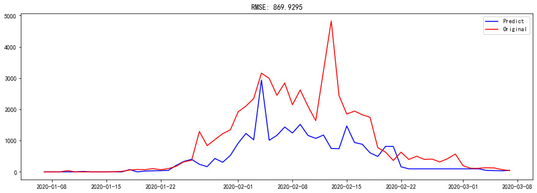
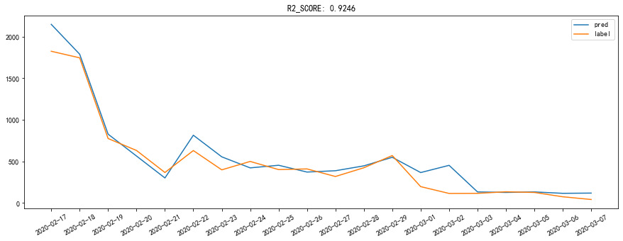

## Prediction of Newly Confirmed Cases of Covid19

- Optimized predictions for Covid19 cases via ML models. Preprocessed and executed feature engineering on small samples
- Applied four supervised models to predict, with Gridsearch parameter tuning & model selection: Decision tree, r^2 = 0.8876
- For ensemble models, stationarized and rollingly sliced time series for ARIMA, with its predictions for creating 18 features 
- Results. Further processed the features, tuned parameters rollingly and selected the best model: GBDT, r^2 = 0.9246. Improved data utilization and obtained accurate prediction on small samples

